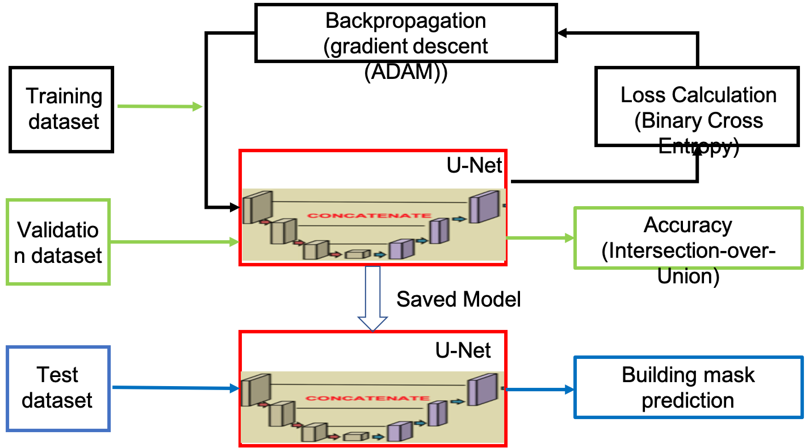

# sat_detect

## *Eric Wang*

**sat_detect** is a U-Net based satellite imaging architecture that is designed to detect buildings on satellite generated maps of the Earth.

### Training and validation

```shell script
> python main2.py
usage: main2.py [-e E] [-lr [LR]]

Train the UNet on images and target masks
save final result to saved_model

optional arguments:
  -e, --epochs     Number of epochs (default: 10)
  -lr [LR], --learning-rate [LR]
                        Learning rate (default: 0.0001)

```
### Testing

```shell script
> python test.py
usage: test.py [-e E]

Load the trained model file from saved_model
Test the UNet on images and target masks

optional arguments:
  -e, --epochs     Number of epochs (default: 1)

```
### Visualization

```shell script
> python vis.py
usage: vis.py

projects images and masks

```

### Folders

```
data: contains images and respective masks
main: trains, validates, and tests data
saved_model: contains outputs of trained data to be tested
unet: basic unet code to run in main
visualization: projects the images and masks into actual visual projections
```



